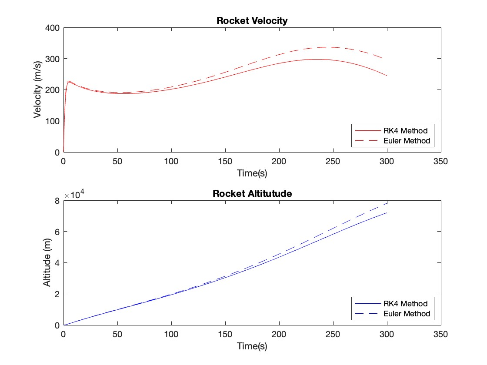
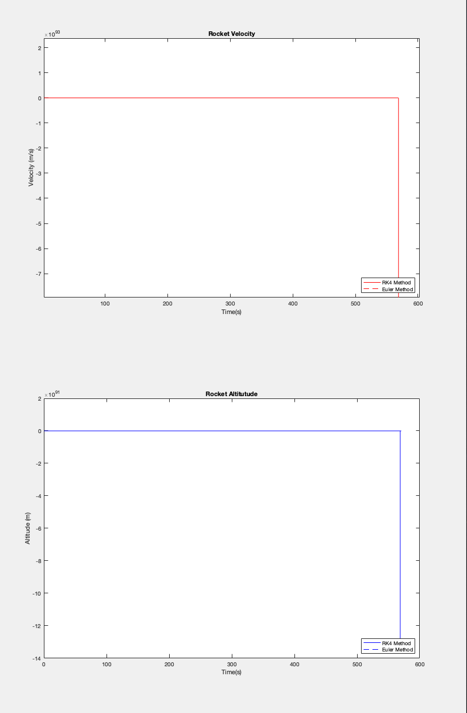

# Overview
This is a project I'm doing as a part of numerical methods of solving problems in physics with code. I hope to be able to apply the fundamentals learned to more complex problems.

**Trajectory Calculation**: performs numerical integration using both the *RK4* and *Euler* methods to solve for the trajectory of the rocket.
## Result

## Limitations
Because this is a simple one-dimensional case, the simulation will break if the acceleration is too negative. This is because of how the drag term
$$
D = \frac{1}{2}\rho_0 e^{-h(t)H^{-1}} C_D A_x v^2,
$$
in addition to the gravity term
$$
\mathcal{G}(t) =  G \frac{m_{E} m(t)}{(R_{E} +h(t))^2}
$$
are always negative. As the 'rocket' begins to fall back down, the acceleration of the rocket rapidly grows excessively negative, and outputs:

